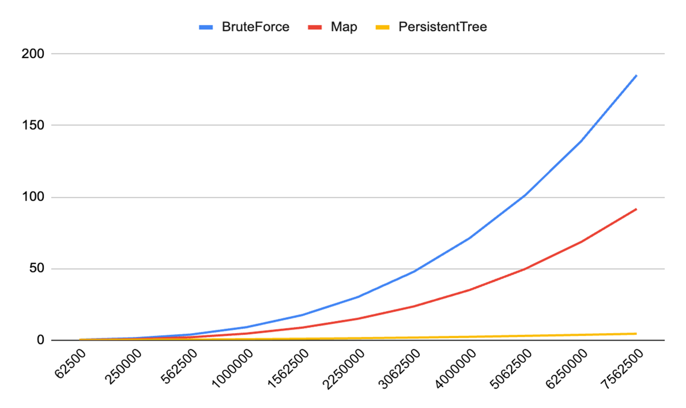

# Лабораторная работа №2
## Задача
> Даны прямоугольники на плоскости с углами в целочисленных координатах. Требуется как можно быстрее выдавать ответ на вопрос «Скольким прямоугольникам принадлежит точка x, y?». Если точка находится на границе прямоугольника, то считается, что она принадлежит ему. Подготовка данных должна занимать как можно меньше времени.>

### Аккаунт в контесте
**rasavelev@edu.hse.ru**

## Алгоритм перебора
### Для каждой точки проверяем каждый прямоугольник и проверяем входит она или нет.

```c++
int BruteForce(std::vector<Rectangle>& recs, Point point){
    int counter = 0;
    for (Rectangle& rectangle : recs) {
        if (rectangle.getLeftPoint().getX() <= point.getX() && point.getX() < rectangle.getRightPoint().getX() &&
            rectangle.getLeftPoint().getY() <= point.getY() && point.getY() < rectangle.getRightPoint().getY()) {
            counter++;
        }
    }
    return counter;
}
```

### Сложность подготовки: O(1)
### Сложность поиска: O(N)

## Алгоритм на карте
### Нужно сжать координаты прямуугольников по осям и с помощью бинарного поиска найти ответ для каждой точки на карте.

```c++
int Map(std::vector<std::vector<int>>& map, Point point) {
    int x = BinSearch(compX, point.getX());
    int y = BinSearch(compY, point.getY());
    if (x < 0 || y < 0) {
        return 0;
    }

    return map[x][y];
}

std::vector<std::vector<int>> BuildMap(std::vector<Rectangle>& rectangles) {
    std::vector<std::vector<int>> map;
    for (auto& rectangle : rectangles) {
        compX.push_back(rectangle.getLeftPoint().getX());
        compX.push_back(rectangle.getRightPoint().getX());
        compY.push_back(rectangle.getLeftPoint().getY());
        compY.push_back(rectangle.getRightPoint().getY());
    }
    std::sort(compX.begin(), compX.end());
    compX.erase(std::unique(compX.begin(), compX.end()), compX.end());

    std::sort(compY.begin(), compY.end());
    compY.erase(std::unique(compY.begin(), compY.end()), compY.end());

    map.resize(compX.size(), std::vector<int>(compY.size(), 0));

    for (auto& rectangle : rectangles) {
        Point leftCompressed(BinSearch(compX, rectangle.getLeftPoint().getX()), BinSearch(compY, rectangle.getLeftPoint().getY()));
        Point rightCompressed(BinSearch(compX, rectangle.getRightPoint().getX()), BinSearch(compY, rectangle.getRightPoint().getY()));
        for (int i = leftCompressed.getX(); i < rightCompressed.getX(); ++i) {
                for (int j = leftCompressed.getY(); j < rightCompressed.getY(); ++j) {
                map[i][j]++;
            }
        }
    }

    return map;
}
```
### Сложность подготовки: O(N^3)
### Сложность поиска: O(log(N))

## Алгоритм на Персистентном дереве отрезков
### Алгоритм заключается в построении дерева отрезков для оптимизации подготовки.

```c++
void Result(vector<Rectangle> &rectangles, vector<Point> &points) {
        if (rectangles.empty()) {
            for (int i = 0; i < points.size(); ++i) {
            }
            return;
        }

        set<int> x, y;
        for (auto& rectangle : rectangles) {
            x.insert(rectangle.getLeftPoint().getX()); x.insert(rectangle.getRightPoint().getX());
            y.insert(rectangle.getLeftPoint().getY()); y.insert(rectangle.getRightPoint().getY());
        }

        vector<int> uniqX(x.cbegin(), x.cend());
        vector<int> uniqY(y.cbegin(), y.cend());

        vector<pair<int, Event>> events;
        for (auto& rectangle : rectangles) {
            pair<int, Event> event;
            
            event.first = distance(uniqX.begin(), upper_bound(uniqX.begin(), uniqX.end(), rectangle.getLeftPoint().getX()));
            event.second.query = 1;
            event.second.start = distance(uniqY.begin(), upper_bound(uniqY.begin(), uniqY.end(), rectangle.getLeftPoint().getY()));
            event.second.end = distance(uniqY.begin(), upper_bound(uniqY.begin(), uniqY.end(), rectangle.getRightPoint().getY()));
            events.push_back(event);

            event.first = distance(uniqX.begin(), upper_bound(uniqX.begin(), uniqX.end(), rectangle.getRightPoint().getX()));
            event.second.query = -1;
            events.push_back(event);
        }

        sort(events.begin(), events.end());

        int count = y.size() - 1;

        Node* root = NewNode(count);

        arr_tree.reserve(x.size() + 1);
        arr_tree.push_back(root);

        for (auto& event : events) {
            if (event.first != (arr_tree.size() - 1)) {
                query(nullptr, arr_tree[arr_tree.size() - 1], event.second.start, event.second.end, event.second.query, true);
            } else {
                query(nullptr, arr_tree[arr_tree.size() - 1], event.second.start, event.second.end, event.second.query, false);
            }
        }

        for (auto& point : points) {
            int x_coord = distance(uniqX.begin(), upper_bound(uniqX.begin(), uniqX.end(), point.getX()));
            int y_coord = distance(uniqY.begin(), upper_bound(uniqY.begin(), uniqY.end(), point.getY()));
            int res = find(x_coord, y_coord, count);
        }
    }
```
### Сложность подготовки: O(N * log(N))
### Сложность поиска: O(log(N))

## График


## Вывод

### Алгоритм перебора подходит для небольших данных данных, тк с ростом числа точек, скорость поиска начинает сильно ухудшаться относительно других алгоримов.
### Алгоритм на карте эффективен, при небольшом количестве прямоугольков, тк сложность его подготовки O(N^3), то при росте количетсва прямоугольников, скорость его работы начинает сильно падать.
### Алгоритм на дереве подходит на больших данных, тк имеет хорошие сложности построеиняя и поиска, и рост как прямоугольников, так и точек, не сильно влияет на данный алгоритм.
